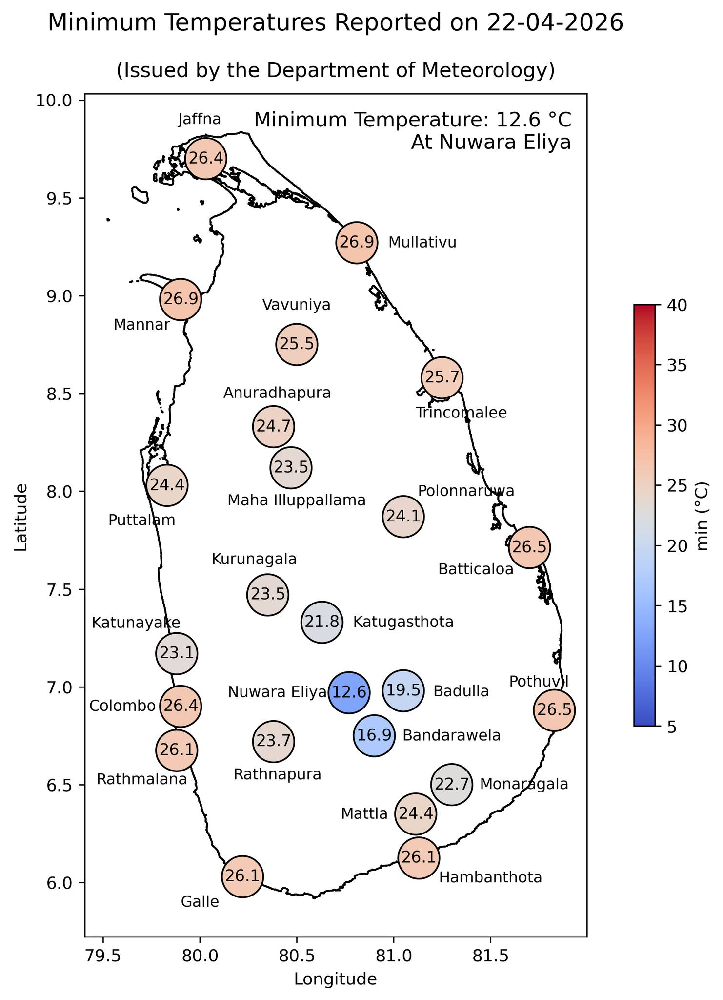

## What is Spatial Data Analysis?

Spatial data analysis deals with data that have a **location component** (e.g., latitude–longitude, regions, grids).

Unlike standard data analysis, spatial data:

-   Are **not independent**

-   Exhibit **spatial structure and dependence**

##  Example

::: columns
::: column
Suppose we measure temperature at several weather stations.

Question:
👉 What is the temperature at an unobserved location?  
:::

::: column

:::
:::

## Spatial systems are often complex systems

- Many interacting components

- Nonlinear relationships

- Feedback loops

## Goals of Spatial Analysis

- Prediction (Interpolation)

- Assimilation of Observations

- Mechanistic Understanding

- Spatial inference 

## Types of Spatial Models

- Descriptive models

- Dynamical models

# History of Spatial Data Analysis

## Why Start with History?

Spatial analysis did not emerge as a single discipline. It evolved from:

- Geography

- Statistics

- Epidemiology

- Environmental science

👉 Understanding the history helps to see:

Why spatial dependence matters

Why standard statistics is not enough

## The First Turning Point: Mapping Disease

- John Snow and the Cholera Map (1854)

- During a cholera outbreak in London, Snow mapped deaths.

He identified a cluster around the Broad Street pump.

👉 Key insight:

- Disease is not randomly distributed in space

## Reading

[https://www.r-bloggers.com/2013/03/john-snows-cholera-data-in-more-formats/](https://www.r-bloggers.com/2013/03/john-snows-cholera-data-in-more-formats/)

##  Early 20th Century: Geography and Spatial Thinking, Walther Tobler (1970)

Tobler formalized what Snow intuitively used:

“Everything is related to everything else, but near things are more related than distant things.”

👉 This became the foundation of:

Spatial correlation

Spatial modeling

## The Problem with Classical Statistics

Traditional statistics assumes:

Observations are independent

But in spatial data:

❌ This assumption fails

Example:

Temperature in Colombo ≠ independent of nearby areas

Dengue cases in one district affect neighboring districts

👉 This led to the birth of spatial statistics

## Mid-20th Century: Birth of Spatial Statistics

Mining and Geology → Kriging

Danie Krige 

- Worked on predicting gold concentrations

- Needed optimal prediction at unobserved locations.

## Georges Matheron

- Formalized geostatistics

- Developed kriging theory

## Rise of Spatial Autocorrelation (1960s–1980s)

Researchers developed measures to quantify spatial structure:

Moran’s I

Geary’s C

## The Computing Revolution (1980s–2000s)

With computers:

Large spatial datasets became manageable

GIS systems emerged

## Esri and GIS Revolution

- Geographic Information Systems (GIS)

- Layer-based spatial analysis

- Integration of maps + data